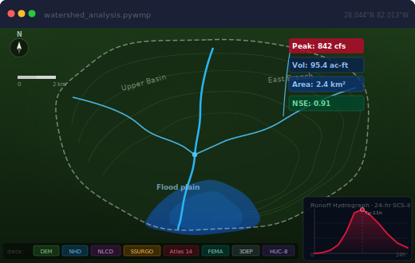

---
hide:
  - toc
---

<section class="gl-hero">
  

    
Open-source · Python · Watershed Modeling

    <h1 class="gl-hero__title">Hydrologic modeling without the friction.</h1>
    
PyWMP automates the full pipeline — spatial data acquisition to flood map — in clean, Python-native code. 1D, 2D, hybrid coupling, calibration, coastal, sediment, water quality.

    

      <a class="md-button md-button--primary" href="installation/">Get started →</a>
      <a class="md-button" href="quickstart/">Quick start</a>
      <a class="md-button" href="https://github.com/mandalanil/pywmp" target="_blank">GitHub ↗</a>
    

  

  
</section>

  

    21
    Modules
  

  

    8+
    Automated datasets
  

  

    5
    Calibration algorithms
  

  

    1D·2D
    Hybrid simulation
  

## What PyWMP does

### Automated data prep
Download DEM (3DEP 1–30 m), watershed boundaries, NHD stream network, NLCD land cover, SSURGO soil groups, composite CN rasters, NOAA Atlas 14, and FEMA flood zones — with one `download_all()` call.

[Dataset reference →](reference/datasets.md)

### 1D hydrologic modeling
SCS CN and Green-Ampt losses. Clark, SCS, and Snyder unit hydrographs. Muskingum and kinematic wave routing. HEC-HMS–compatible multi-subbasin network.

[Full pipeline tutorial →](tutorials/full_pipeline.md)

### 2D floodplain simulation
Rain-on-mesh ROM solver over DEM-derived grids. HAND-based inundation depth mapping. Export to GeoTIFF and Cloud Optimized GeoTIFF for web sharing.

[Module reference →](reference/modules.md)

### Hybrid 1D–2D coupling
Outlet-to-inflow-BC and excess-precip distribution modes. Combine 1D channel routing accuracy with 2D spatial flood extent in a single run.

[Hybrid coupling tutorial →](tutorials/hybrid_coupling.md)

### Calibration & optimization
`CalibrationEngine` with differential evolution, Nelder-Mead, dual annealing, LHS, and grid search. NSE, KGE, PBIAS, RMSE objective functions. Morris and Sobol sensitivity.

[Calibration tutorial →](tutorials/calibration_validation.md)

### Model validation
`HydroMetrics` for gauge-based skill scores. `SpatialFloodValidation` for raster extent comparison — CSI, hit rate, false alarm ratio, F1, area bias.

[Validation reference →](reference/validation.md)

### Coastal modeling
`SeawallGeometry` and storm surge routing. TC intensity estimator. `SeawallSLRSweep` for multi-scenario sea-level rise analysis across return periods.

[Coastal reference →](reference/coastal.md)

### Sediment transport
Bedload via Meyer-Peter–Müller. Cohesive suspended sediment. `MorphodynamicBed` for iterative bed evolution. Stokes settling velocity by particle class.

[Sediment & WQ tutorial →](tutorials/sediment_wq.md)

### Water quality
TSS and total phosphorus transport coupled to 1D discharge. EMC lookup table for 25 NLCD classes. Sub-daily constituent loading estimation.

[WQ reference →](reference/wq.md)

### REST API & deployment
FastAPI server — submit HMS and Cascade runs, stream live progress over WebSocket, poll results. Upload `.dat` files. Docker Compose included, scale with `--workers`.

[REST API tutorial →](tutorials/rest_api.md)

[Read the API reference](reference/index.md){ .md-button .md-button--primary }
[Browse tutorials](tutorials/full_pipeline.md){ .md-button }
[View on GitHub](https://github.com/mandalanil/pywmp){ .md-button }
